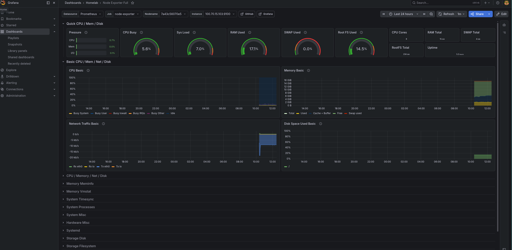
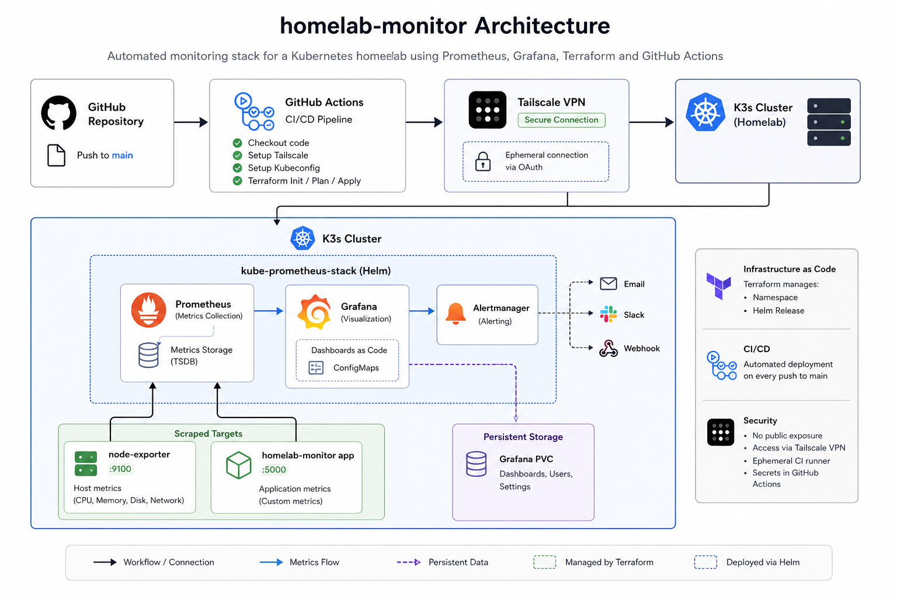

# homelab-monitor

A production-style monitoring stack for a self-hosted Kubernetes homelab — built with Prometheus, Grafana, and automated via Terraform and GitHub Actions CI/CD.



---

## The Story

This project started as a simple Docker Compose setup — Prometheus and Grafana running as containers on a single server with no automation, no persistence, and no real infrastructure story.

As my homelab evolved toward Kubernetes (K3s), I migrated the entire monitoring stack to match — deploying it properly via Helm, managing it as Infrastructure as Code with Terraform, and automating deployments through a GitHub Actions CI/CD pipeline.

---

## Architecture



---

## Stack

| Tool                      | Purpose                                                            |
| ------------------------- | ------------------------------------------------------------------ |
| **K3s**                   | Lightweight Kubernetes distribution                                |
| **kube-prometheus-stack** | Helm chart bundling Prometheus + Grafana + Alertmanager            |
| **Prometheus**            | Metrics collection and storage                                     |
| **Grafana**               | Metrics visualization and dashboards                               |
| **node-exporter**         | Host-level metrics (CPU, memory, disk, network)                    |
| **Terraform**             | Infrastructure as Code — manages namespace and Helm release        |
| **GitHub Actions**        | CI/CD pipeline — runs Terraform on every push to main              |
| **Tailscale**             | Secure private network — GitHub runner connects to homelab via VPN |

---

## Migration: Docker → Kubernetes

The original setup used Docker Compose:

```yaml
# Old docker-compose.yml (kept for reference)
services:
  prometheus:
    image: prom/prometheus
    ports:
      - "9090:9090"
  grafana:
    image: grafana/grafana
    ports:
      - "3000:3000"
```

**Problems with this approach:**

- Manual deployment — no automation
- No persistence — dashboards lost on restart
- Not reproducible — required remembering setup steps
- Doesn't scale — tightly coupled to one host

**The Kubernetes solution:**

- Helm chart manages the full stack declaratively
- Persistent volume keeps Grafana data across pod restarts
- Dashboards stored as ConfigMaps — loaded automatically on startup
- Terraform owns the infrastructure — one `terraform apply` to rebuild
- GitHub Actions deploys on every push — no manual steps

---

## How to Deploy

### Prerequisites

- K3s cluster running
- Helm installed
- Terraform installed
- Tailscale OAuth credentials
- GitHub repository secrets configured

### GitHub Actions Secrets Required

| Secret               | Description                                 |
| -------------------- | ------------------------------------------- |
| `TS_OAUTH_CLIENT_ID` | Tailscale OAuth client ID                   |
| `TS_OAUTH_SECRET`    | Tailscale OAuth secret                      |
| `KUBECONFIG`         | kubeconfig pointing to homelab Tailscale IP |

### Deploy

Push to `main` — GitHub Actions handles the rest:

```bash
git push origin main
```

The pipeline will:

1. Connect to homelab via Tailscale VPN
2. Configure kubeconfig
3. Run `terraform init`
4. Run `terraform plan`
5. Run `terraform apply`

### Manual Deploy

```bash
cd terraform
terraform init
terraform apply
```

---

## What's Being Monitored

| Target            | Port | Metrics                    |
| ----------------- | ---- | -------------------------- |
| `node-exporter`   | 9100 | CPU, memory, disk, network |
| `homelab-monitor` | 5000 | Custom application metrics |

Prometheus scrapes both targets via `additionalScrapeConfigs` in `prometheus-values.yml`.

---

## Project Structure

```
homelab-monitor/
├── .github/
│   └── workflows/
│       └── deploy.yml          # GitHub Actions CI/CD pipeline
├── docker-compose.yml          # Original Docker setup (migration reference)
├── grafana/
│   └── dashboards/
│       └── nodes.json          # Node Exporter dashboard as code
├── k3s/
│   └── prometheus-values.yml   # Helm values (scrape configs, persistence)
└── terraform/
    └── main.tf                 # Manages namespace + Helm release
```

---

## Security

- Homelab is not publicly exposed — accessible only via Tailscale VPN
- GitHub Actions runner connects via ephemeral Tailscale OAuth node
- No credentials stored in code — all secrets via GitHub Actions secrets

---

## Key Concepts Demonstrated

- **Infrastructure as Code** — Terraform manages all Kubernetes resources
- **GitOps pattern** — every infrastructure change goes through Git
- **Stateful workloads** — persistent volumes for Grafana data survival
- **Dashboard as code** — Grafana dashboards provisioned via ConfigMaps
- **Private CI/CD** — GitHub Actions reaching a private homelab via VPN
- **Observability** — metrics collection, storage, and visualization pipeline
